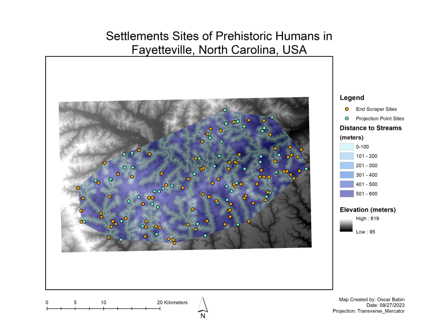

# Investigating Prehistoric Settlement Patterns Near Streams

  

This project analyzes spatial patterns in prehistoric human settlement sites near streams in Fayetteville, North Carolina. Using ArcGIS Desktop and chi-square statistical analysis, the goal is to determine whether the proximity to water significantly influenced the location of archaeological artifacts.

---

## Project Objective

To evaluate the relationship between stream proximity and prehistoric site locations using spatial and statistical methods in a GIS environment.

---

## Tools and Techniques

- **ArcGIS Desktop**
- **Geoprocessing Tools**: Merge, Clip, Intersect
- **Minimum Bounding Geometry**
- **Buffer Overlay and Area Calculation**
- **Spatial Join for Site Distance Classification**
- **Chi-Square Statistical Analysis**
- **Projection Used**: Local projection defined by the `GlimpsesArea` raster (DEM)

---

## Analytical Workflow

1. **Merge Point Datasets**: Combined end scraper and projectile point sites.
2. **Create Representative Area**: Used convex hull bounding geometry around merged sites.
3. **Clip Buffer Zones**: Intersected stream buffer polygons with the representative area.
4. **Calculate Area Fractions**: For each distance buffer (e.g., 0–100m, 100–200m).
5. **Perform Site Intersections**: Matched each archaeological site to its corresponding buffer zone.
6. **Observed vs. Expected Counts**: Computed based on random distribution assumption.
7. **Chi-Square Test**: Determined if observed clustering near water is statistically significant.

---

## Key Findings

- A significant portion of projectile point and end scraper sites were found within **0–100 meters** of streams.
- The **chi-square tests** revealed that site distribution is **non-random**:
  - **p-values < 0.05**, indicating statistical significance.
- Proximity to water likely influenced where early humans lived or conducted tool-making activities.

---

## Interpretation Highlights

- **Why near water?**
  - Water access, food resources, and transportation
- **Why possibly away?**
  - Flood avoidance, defensibility, better terrain
- **Conclusion**: Patterns are not due to chance. Water likely played a key role in site selection.

---

## Date

October 2023  
Created by: Oscar Babin

---

## Additional Resources

For a comprehensive analysis of this study, including:
- Detailed statistical tables and chi-square test results
- Complete methodology documentation
- Extended findings and interpretations
- Additional maps and visualizations

Please refer to the [full PDF report](./human_settlement_map.pdf).
